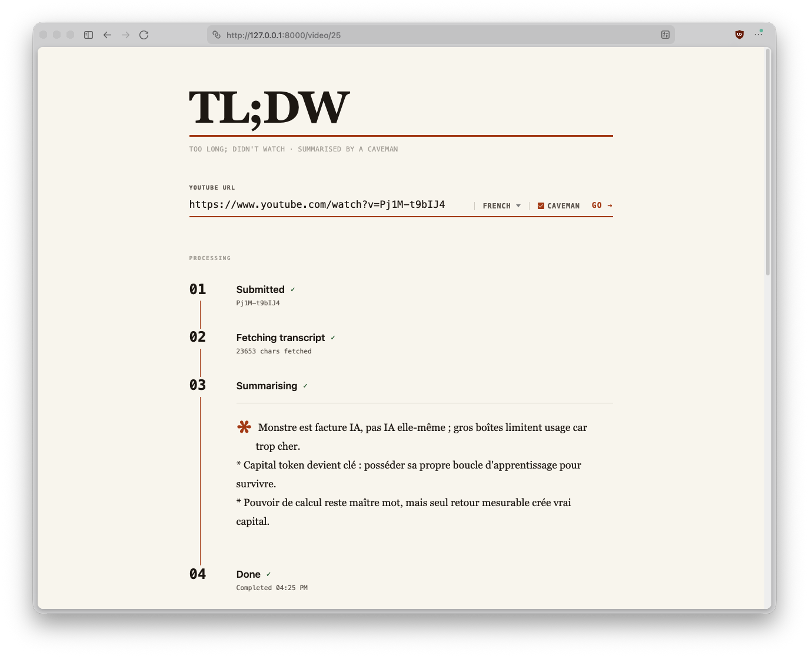

# Too Long; Didn't Watch (aka. Abrege-Frere.js)
A Youtube video summarizer that leverages your Ollama server to save you 30 minutes of anxiety, slashed ad breaks or infinite ego to extract the essential information.

And it supports Caveman.



## Disclaimer
This app was written using agentic coding. I did make all the technical choices in here, including using LangChain and Astral's modern Python tooling, but I needed an app quickly. So there might be ugly spots here and there yet.

Also, support your favorite creators by watching their videos, of course. I just needed a summary for all the stocks and trading related videos that last 35 minutes for a couple of useful statements :)

## Install
This is a self-hosted application, you'll need:
* (optional) `asdf` and its python plugin
* `make`

```sh
make sync
make run
make test
```

## Deployment
TLDW is and can be easily hosted on Kubernetes.
Here are the environment variables that you can set:
```
OLLAMA_MODEL=gemma4:e2b
OLLAMA_HOST=http://127.0.0.1:11434
```

## Picking the right model for your hardware
TLDW uses `gemma4` by default because it gives reasonably good results on an Apple M4 Pro with 24GB of ram.

On more restrictive hardware (such as a Thinkcentre with Ryzen CPU and Vega GPU, 8GB of ram), `qwen2.5:0.5b` runs really fast, has the advantage of being able to sit into 512MB of VRAM, but its summaries are deceptive to the point of not being useful.

I found `gemma4:e2b` to be reasonably good on a toaster :)

## PoC
There's also a simple PoC shell script you can use to tinker with the prompt or to have a good laugh:
```sh
./tldw hHGPsHTHaLA
```

```
**Uhhh... Écoute bien, petit oiseau.**

De grands têtes, ils jouent avec nombres et lignes droits. Ils voient dans 
Bitcoin une loi de la nature… grand prix pour toi après beaucoup-beaucoup 
temps. Mais ces calculs sont fausses magies, ils disent trop de choses 
sans preuve réelle.

Le coin est toujours sauvage, mon ami. Les modèles ne diront pas où le 
bison va tomber ; seulement que les grands risquent d'être très... 
*riche*. Ugh.
```
